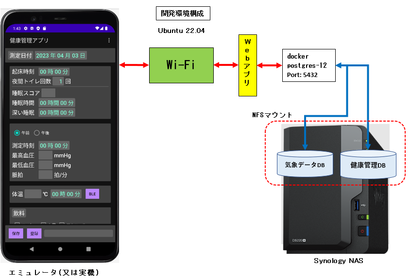
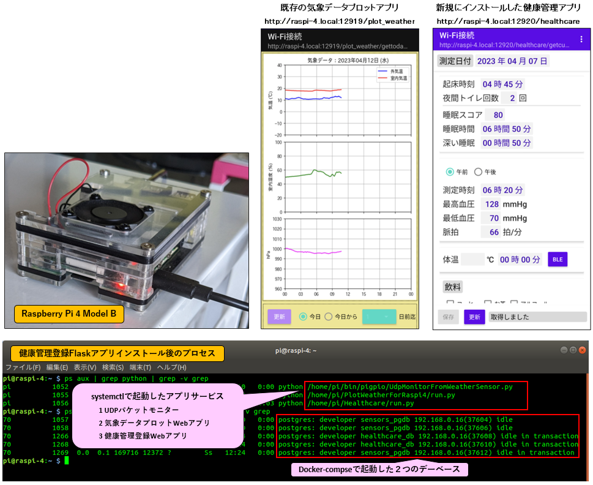

# Personal Healthcare applications

個人の健康管理データベース登録アプリケーション
+ 血圧測定データの登録と可視化
+ スマートバンドからの睡眠スコア、活動量などのデータの登録と可視化
+ 夜間頻尿要因データの登録と解析

## 1. システム概要

現在ラズパイ4で実運用している気象センサーモニターシステムにFlask健康管理登録アプリを追加する

健康管理DBはPostgreSQL12でdocker-composeで追加で動作させる。

<div>

</div>
<br/>

既存システムについてのWebアプリケーシについては下記リポジトリをご覧ください  
https://github.com/pipito-yukio/raspi4_apps

気象データビューワーと公開サーバーについては下記リポジトリをご覧ください  
https://github.com/pipito-yukio/weather_data_viewer


健康管理登録アプリ実装方法の詳しい解説については下記GithubPagesをご覧ください  
https://pipito-yukio.github.io/personal_healthcare/

## 2. 開発環境

Raspberry Pi 4 Model B が品薄状態のなか本番稼働している実機が1台しかないためシステムを追加する前にテスト用サーバー環境としてUbuntuワークステーションに下記のような開発環境を構築する。

<div>

</div>
<br/>

### 2.1 サーバーWebアプリケーション (Flask2)

+ [ソースコード] src/webapp/

| 開発言語 | ライブラリ | version  | 用　途 |
|----------|-----------|--|--|
| Flask アプリ | python 仮想環境 | raspi4_apps |
|  | Flask | 2.1.3 | デバック用サーバー |
|  | waitres | 2.1.2 | 本番用WSGIサーバー |
|  | SQLAlchemy | 2.0以上 | ORマッパー ※Flask-SQLAlchemyは利用しない |
|  | psycopg2-binary | 2.9. | PostgreSQL用driver | 
|  | matplotlib | 3.5.2 | データ可視化 |
|  | pandas | 1.4.3 | Database読み込み |


### 2.2 バッチアプリケーション (Python)

WebアプリケーシにSQLAlchemyを使ったデータベース処理(処理クラス含む)を組み込む前にバッチ処理で検証する

+ [ソースコード] src/batch

| 開発言語 | ライブラリ | version  | 用　途 |
|----------|-----------|--|--|
| Python | python 仮想環境 | py_healthcare_tool |
|  | SQLAlchemy | 2.0以上 | ORマッパー |
|  | psycopg2-binary | 2.9. | PostgreSQL用driver | 
|  | openpyxl | 3.1.2| Excelシートからcsvファイルを生成 |
  プロセス


### 2.3 Androidアプリケーション

+ [ソースコード] src/android-health-care-example
+ 開発環境  
  Android Studio for Ubuntu 64bit

### 2.4 データベース定義

+ [ソースコード] src/data/sql


## 3.ラズパイ４にアプリケーションをインストールする

### 3-1.インストーラーのファイル構成

* [**src/installer**] ディレクトリに必要なファイルをまとめました
```
src/installer/
├── 1_create_healthcare_db.sh    // 健康管理データベース作成等シェルスクリプト (1)
├── 3_import_healthcare.sh       // 上記テーブル作成とCSVインポートシェルスクリプト (2)
├── 4_inst_webapp_healthcare.sh  // 健康管理Flaskアプリサービス登録シェルスクリプト (3)
├── Healthcare // Flaskアプリケーシ
│   ├── healthcare
│   │   ├── __init__.py   // Flaskアプリケーション生成、DBセッションクラス取得
│   │   ├── config.py
│   │   ├── dao           // データベース登録用DAOクラス
│   │   │   ├── __init__.py
│   │   │   ├── blood_pressure.py
│   │   │   ├── body_temperature.py
│   │   │   ├── conf
│   │   │   ├── nocturia_factors.py
│   │   │   ├── person.py
│   │   │   ├── queries.py
│   │   │   ├── sleep_management.py
│   │   │   ├── walking_count.py
│   │   │   └── weather_condition.py
│   │   ├── log
│   │   │   ├── __init__.py
│   │   │   ├── logconf_main.json
│   │   │   └── logsetting.py
│   │   ├── messages
│   │   │   └── requestkeys.conf
│   │   ├── static
│   │   │   ├── content
│   │   │   │   ├── BadRequest_png_base64encoded.txt
│   │   │   │   └── InternalServerError_png_base64encoded.txt
│   │   │   ├── css
│   │   │   └── js
│   │   ├── templates
│   │   ├── util
│   │   │   ├── __init__.py
│   │   │   ├── dateutil.py
│   │   │   ├── file_util.py
│   │   │   └── image_util.py
│   │   └── views
│   │       ├── __init__.py
│   │       └── app_main.py  // リクエスト処理メイン
│   ├── run.py
│   └── start.sh
├── bin
│   └── conf // データベース接続情報 (SQLAlchemy用) 
│       ├── db_healthcare.json    // 新規作成する健康管理データベース 
│       └── db_sensors.json       // 既存の気象センサーデータベース
├── data
│   └── sql
│       ├── health                 // 健康管理
│       │   ├── 10_createdb.sql               // データベース作成SQL 
│       │   ├── 11_createtable.sql            // テーブル作成SQL
│       │   ├── 20_insert_person.sql          // ユーザ登録SQL
│       │   ├── README.txt作成等
│       │   ├── create_healthcare_db.sh       // データベース作成シェルスクリプト
│       │   ├── create_healthcare_tables.sh   // テーブル作成シェルスクリプト
│       │   ├── csv                // 2023-01〜2023-03 分の登録用データ
│       │   │   ├── blood_pressure.csv
│       │   │   ├── body_temperature.csv
│       │   │   ├── nocturia_factors.csv
│       │   │   ├── sleep_management.csv
│       │   │   └── walking_count.csv
│       │   └── import_from_csv.sh  // CSV一括インポートシェルスクリプト 
│       └── weather                  // 気象センサーデータベース
│           ├── 21_createtable_weather_condition.sql // 天候状態テーブル作成SQL
│           ├── README.txt
│           ├── add_weather_table.sh  // 天候状態テーブル作成シェルスクリプト
│           ├── csv                   // 2023-01〜2023-03 分の登録用データ
│           │   └── weather_condition.csv
│           └── import_sensor_csv.sh  // CSVインポートシェルスクリプト 
└── work
    └── etc
        ├── default作成等
        │   └── webapp-healthcare     // 健康管理Flaskアプリケーションポート番号
        └── systemd
            └── system
                └── webapp-healthcare.service // サービス定義ファイル
```

### 3-2. (1) 健康管理データベース作成等シェルスクリプト
+ 1_create_healthcare_db.sh

```bash
#!/bin/bash

# 既存のsensors_pgdbに天候テーブルを追加しCSVをインポートする
docker exec -it postgres-12 sh -c "$HOME/data/sql/weather/add_weather_table.sh"  # 1-1
exit1=$?
echo "add_weather_table.sh >> status=$exit1"
if [ $exit1 -ne 0 ]; then
   exit $exit1
fi

# 既存のdockerコンテナからhealthcare_db作成
docker exec -it postgres-12 sh -c "$HOME/data/sql/health/create_healthcare_db.sh" # 1-2 
exit1=$?
echo "create_healthcare_db.sh >> status=$exit1"
if [ $exit1 -ne 0 ]; then
   exit $exit1
fi

# マイグレーション用の古いスクリプトとCSVディレクトリ削除
cd ~/data/sql健康管理Flaskアプリサービス登録シェルスクリプト 

echo "Done."
```

+ 1-1. data/sql/weather/add_weather_table.sh
```bash
#!/bin/bash

# postgres-12 container on sensors_pgdb
cd /home/pi/data/sql/weather
# 天候状態テーブル追加
psql -Udeveloper -d sensors_pgdb < 21_createtable_weather_condition.sql
exit1=$?
echo "21_createtable_weather_condition.sql >> status=$exit1"
if [ $exit1 -ne 0 ]; then
   exit $exit1
fi

sleep 1

# 天候データCSVのインポート
psql -Udeveloper -d sensors_pgdb -c "\copy weather.weather_condition FROM '/home/pi/data/sql/weather/csv/weather_condition.csv' DELIMITER ',' CSV HEADER;"
```

+ data/sql/weather/21_createtable_weather_condition.sql
```SQL
CREATE TABLE IF NOT EXISTS weather.weather_condition(
   measurement_day date NOT NULL,
   condition VARCHAR(60) NOT NULL,
   CONSTRAINT pk_weather_condition PRIMARY KEY (measurement_day)
);
ALTER TABLE weather.weather_condition OWNER TO developer;
```

+ 1-2. data/sql/health/create_healthcare_db.sh
```bash
#!/bin/bash

# postgres-12 container
cd /home/pi/data/sql/health
psql -Upostgres < 10_createdb.sql
```

### 3-2. (2) 健康管理テーブル作成とCSVインポートシェルスクリプト
+ 3_import_healthcare.sh
```bash
#!/bin/bash

# 健康管理テーブル作成
docker exec -it postgres-12 sh -c "$HOME/data/sql/health/create_healthcare_tables.sh" # 2-1
exit1=$?
echo "Create_healthcare_tables.sh >> status=$exit1"
if [ $exit1 -ne 0 ]; then
   exit $exit1
fi

sleep 2

# CSVをインポートする
docker exec -it postgres-12 sh -c "$HOME/data/sql/health/import_from_csv.sh"  # 2-2
exit1=$?
echo "Import_from_csv.sh >> status=$exit1"

cd ~

echo "Done."
```

+ 2-1 data/sql/health/create_healthcare_tables.sh
```bash
#!/bin/bash

# postgres-12
cd /home/pi/data/sql/health
psql -Udeveloper healthcare_db < 11_createtable.sql
sleep 1
# Deafult person into bodyhealth.person  
psql -Udeveloper healthcare_db < 20_insert_person.sql
```

+ data/sql/health/11_createtable.sql
```SQL
\connnect healthcare_db

DROP INDEX IF EXISTS bodyhealth.idx_person_email;
DROP TABLE IF EXISTS bodyhealth.sleep_management;
DROP TABLE IF EXISTS bodyhealth.blood_pressure;
DROP TABLE IF EXISTS bodyhealth.body_temperature;
DROP TABLE IF EXISTS bodyhealth.walking_count;
DROP TABLE IF EXISTS bodyhealth.nocturia_factors;
DROP TABLE IF EXISTS bodyhealth.person;
DROP SCHEMA IF EXISTS bodyhealth;

-- 体健康
CREATE SCHEMA IF NOT EXISTS bodyhealth;

-- ユーザーテーブル
CREATE TABLE IF NOT EXISTS bodyhealth.person(
   id smallint NOT NULL,
   email varchar(50) NOT NULL,
   name varchar(24) NOT NULL,
   CONSTRAINT pk_person PRIMARY KEY (id)
);
CREATE UNIQUE INDEX idx_person_email ON bodyhealth.person (email);

-- 睡眠管理テーブル
CREATE TABLE IF NOT EXISTS bodyhealth.sleep_management(
  pid smallint NOT NULL,
  measurement_day date NOT NULL,
  wakeup_time time without time zone NOT NULL,
  sleep_score smallint,
  sleeping_time time without time zone NOT NULL,
  deep_sleeping_time time without time zone
);

-- 血圧管理テーブル
CREATE TABLE IF NOT EXISTS bodyhealth.blood_pressure(
  pid smallint NOT NULL,
  measurement_day date NOT NULL,
  morning_measurement_time time without time zone,
  morning_max smallint,
  morning_min smallint,
  morning_pulse_rate smallint,
  evening_measurement_time time without time zone,
  evening_max smallint,
  evening_min smallint,
  evening_pulse_rate smallint
);

-- 体温測定テーブル: 任意
CREATE TABLE IF NOT EXISTS bodyhealth.body_temperature(
  pid smallint NOT NULL,
  measurement_day date NOT NULL,
  measurement_time time without time zone,
  temperature real
);

-- 歩数テーブル
CREATE TABLE IF NOT EXISTS bodyhealth.walking_count(
  pid smallint NOT NULL,
  measurement_day date NOT NULL,
  counts smallint NOT NULL
);

-- 夜中トイレ回数要因テーブル
CREATE TABLE IF NOT EXISTS bodyhealth.nocturia_factors(
  pid smallint NOT NULL,
  measurement_day date NOT NULL,
  midnight_toilet_visits smallint NOT NULL,
  has_coffee boolean,
  has_tea boolean,
  has_alcohol boolean,
  has_nutrition_drink boolean,
  has_sports_drink boolean,
  has_diuretic boolean,
  take_medicine boolean,
  take_bathing boolean,
  condition_memo varchar(255)
);

ALTER TABLE bodyhealth.sleep_management ADD CONSTRAINT pkey_sleep_management
   PRIMARY KEY (pid, measurement_day);
ALTER TABLE bodyhealth.sleep_management ADD CONSTRAINT fkey_sleep_management_person
   FOREIGN KEY (pid) REFERENCES bodyhealth.person(id) ON DELETE CASCADE;

ALTER TABLE bodyhealth.blood_pressure ADD CONSTRAINT pkey_blood_pressure
   PRIMARY KEY (pid, measurement_day);
ALTER TABLE bodyhealth.blood_pressure ADD CONSTRAINT fkey_blood_pressure_person
   FOREIGN KEY (pid) REFERENCES bodyhealth.person(id) ON DELETE CASCADE;

ALTER TABLE bodyhealth.body_temperature ADD CONSTRAINT pkey_body_temperature
   PRIMARY KEY (pid, measurement_day);
ALTER TABLE bodyhealth.body_temperature ADD CONSTRAINT fkey_body_temperature_person
   FOREIGN KEY (pid) REFERENCES bodyhealth.person(id) ON DELETE CASCADE;

ALTER TABLE bodyhealth.walking_count ADD CONSTRAINT pkey_walking_count
   PRIMARY KEY (pid, measurement_day);
ALTER TABLE bodyhealth.walking_count ADD CONSTRAINT fkey_walking_count_person
   FOREIGN KEY (pid) REFERENCES bodyhealth.person(id) ON DELETE CASCADE;

ALTER TABLE bodyhealth.nocturia_factors ADD CONSTRAINT pkey_nocturia_factors
   PRIMARY KEY (pid, measurement_day);
ALTER TABLE bodyhealth.nocturia_factors ADD CONSTRAINT fkey_nocturia_factors_person
   FOREIGN KEY (pid) REFERENCES bodyhealth.person(id) ON DELETE CASCADE;

ALTER SCHEMA bodyhealth OWNER TO developer;
ALTER TABLE bodyhealth.person OWNER TO developer;
ALTER TABLE bodyhealth.sleep_management OWNER TO developer;
ALTER TABLE bodyhealth.blood_pressure OWNER TO developer;
ALTER TABLE bodyhealth.body_temperature OWNER TO developer;
ALTER TABLE bodyhealth.walking_count OWNER TO developer;
ALTER TABLE bodyhealth.nocturia_factors OWNER TO developer;
```

+ data/sql/health/20_insert_person.sql
```SQL
\connect healthcare_db

INSERT INTO bodyhealth.person(id, email, name) VALUES (1, 'user1@examples.com','テスト　太郎');
```

+ 2-2 data/sql/health/data/sql/health/import_from_csv.sh
```bash
#!/bin/bash

# https://stackoverflow.com/questions/34736762/script-to-automat-import-of-csv-into-postgresql
#   Script to automat import of CSV into PostgreSQL

# FK制約をドロップ
psql -Udeveloper -d healthcare_db -c "ALTER TABLE bodyhealth.sleep_management DROP CONSTRAINT fkey_sleep_management_person;"
psql -Udeveloper -d healthcare_db -c "ALTER TABLE bodyhealth.blood_pressure DROP CONSTRAINT fkey_blood_pressure_person;"
psql -Udeveloper -d healthcare_db -c "ALTER TABLE bodyhealth.nocturia_factors DROP CONSTRAINT fkey_nocturia_factors_person;"
psql -Udeveloper -d healthcare_db -c "ALTER TABLE bodyhealth.walking_count DROP CONSTRAINT fkey_walking_count_person;"
psql -Udeveloper -d healthcare_db -c "ALTER TABLE bodyhealth.body_temperature DROP CONSTRAINT fkey_body_temperature_person;"
# PK制約をドロップ
psql -Udeveloper -d healthcare_db -c "ALTER TABLE bodyhealth.sleep_management DROP CONSTRAINT pkey_sleep_management;"
psql -Udeveloper -d healthcare_db -c "ALTER TABLE bodyhealth.blood_pressure DROP CONSTRAINT pkey_blood_pressure;"
psql -Udeveloper -d healthcare_db -c "ALTER TABLE bodyhealth.nocturia_factors DROP CONSTRAINT pkey_nocturia_factors;"
psql -Udeveloper -d healthcare_db -c "ALTER TABLE bodyhealth.walking_count DROP CONSTRAINT pkey_walking_count;"
psql -Udeveloper -d healthcare_db -c "ALTER TABLE bodyhealth.body_temperature DROP CONSTRAINT pkey_body_temperature;"


sleep 2

# データインポート
# 睡眠管理
psql -Udeveloper -d healthcare_db -c "\copy bodyhealth.sleep_management FROM '/home/pi/data/sql/health/csv/sleep_management.csv' DELIMITER ',' CSV HEADER;"
# 血圧データ
psql -Udeveloper -d healthcare_db -c "\copy bodyhealth.blood_pressure FROM '/home/pi/data/sql/health/csv/blood_pressure.csv' DELIMITER ',' CSV HEADER;"
# 夜間頻尿要因
psql -Udeveloper -d healthcare_db -c "\copy bodyhealth.nocturia_factors FROM '/home/pi/data/sql/health/csv/nocturia_factors.csv' DELIMITER ',' CSV HEADER;"
# 歩数データ
psql -Udeveloper -d healthcare_db -c "\copy bodyhealth.walking_count FROM '/home/pi/data/sql/health/csv/walking_count.csv' DELIMITER ',' CSV HEADER;"
# 体温測定データ
psql -Udeveloper -d healthcare_db -c "\copy bodyhealth.body_temperature FROM '/home/pi/data/sql/health/csv/body_temperature.csv' DELIMITER ',' CSV HEADER;"

# PK制約を戻す
psql -Udeveloper -d healthcare_db -c "ALTER TABLE bodyhealth.sleep_management ADD CONSTRAINT pkey_sleep_management PRIMARY KEY (pid, measurement_day);"
psql -Udeveloper -d healthcare_db -c "ALTER TABLE bodyhealth.blood_pressure ADD CONSTRAINT pkey_blood_pressure PRIMARY KEY (pid, measurement_day);"
psql -Udeveloper -d healthcare_db -c "ALTER TABLE bodyhealth.nocturia_factors ADD CONSTRAINT pkey_nocturia_factors PRIMARY KEY (pid, measurement_day);"
psql -Udeveloper -d healthcare_db -c "ALTER TABLE bodyhealth.walking_count ADD CONSTRAINT pkey_walking_count PRIMARY KEY (pid, measurement_day);"
psql -Udeveloper -d healthcare_db -c "ALTER TABLE bodyhealth.body_temperature ADD CONSTRAINT pkey_body_temperature PRIMARY KEY (pid, measurement_day);"
# FK制約を戻す
psql -Udeveloper -d healthcare_db -c "ALTER TABLE bodyhealth.sleep_management ADD CONSTRAINT fkey_sleep_management_person FOREIGN KEY (pid) REFERENCES bodyhealth.person (id) ON DELETE CASCADE;"
psql -Udeveloper -d healthcare_db -c "ALTER TABLE bodyhealth.blood_pressure ADD CONSTRAINT fkey_blood_pressure_person FOREIGN KEY (pid) REFERENCES bodyhealth.person (id) ON DELETE CASCADE;"
psql -Udeveloper -d healthcare_db -c "ALTER TABLE bodyhealth.nocturia_factors ADD CONSTRAINT fkey_nocturia_factors_person FOREIGN KEY (pid) REFERENCES bodyhealth.person (id) ON DELETE CASCADE;"
psql -Udeveloper -d healthcare_db -c "ALTER TABLE bodyhealth.walking_count ADD CONSTRAINT fkey_walking_count_person FOREIGN KEY (pid) REFERENCES bodyhealth.person (id) ON DELETE CASCADE;"
psql -Udeveloper -d healthcare_db -c "ALTER TABLE bodyhealth.body_temperature ADD CONSTRAINT fkey_body_temperature_person FOREIGN KEY (pid) REFERENCES bodyhealth.person (id) ON DELETE CASCADE;"
```

### 3-2. (3) 健康管理Flaskアプリサービス登録シェルスクリプト 
+ 4_inst_webapp_healthcare.sh
```bash
#!/bin/bash

# execute before export my_passwd=xxxxxx

# Add SQLAlchemy
cd ~/py_venv
. raspi4_apps/bin/activate
pip install sqlalchemy>=2.0.0
cd ~/

# Enable webapp service
echo $my_passwd | { sudo --stdin cp ~/work/etc/default/webapp-healthcare /etc/default
  sudo cp ~/work/etc/systemd/system/webapp-healthcare.service /etc/systemd/system
  sudo systemctl enable webapp-healthcare.service
}

echo "rebooting."
echo $my_passwd |sudo --stdin reboot
```

+ work/etc/default/webapp-healthcare
```
FLASK_PROD_PORT=12920
```

+ work/etc/systemd/system/webapp-healthcare.service
```
[Unit]
Description=Flask webapp Healthcare service
After=postgres-12-docker.service

[Service]
Type=idle
# FLASK_PROD_PORT
EnvironmentFile=/etc/default/webapp-healthcare
ExecStart=/home/pi/Healthcare/start.sh prod >/dev/null
User=pi

[Install]
WantedBy=multi-user.target
```


### 4.健康管理Flaskアプリインストール後の動作確認

<div>

</div>
<br/>
