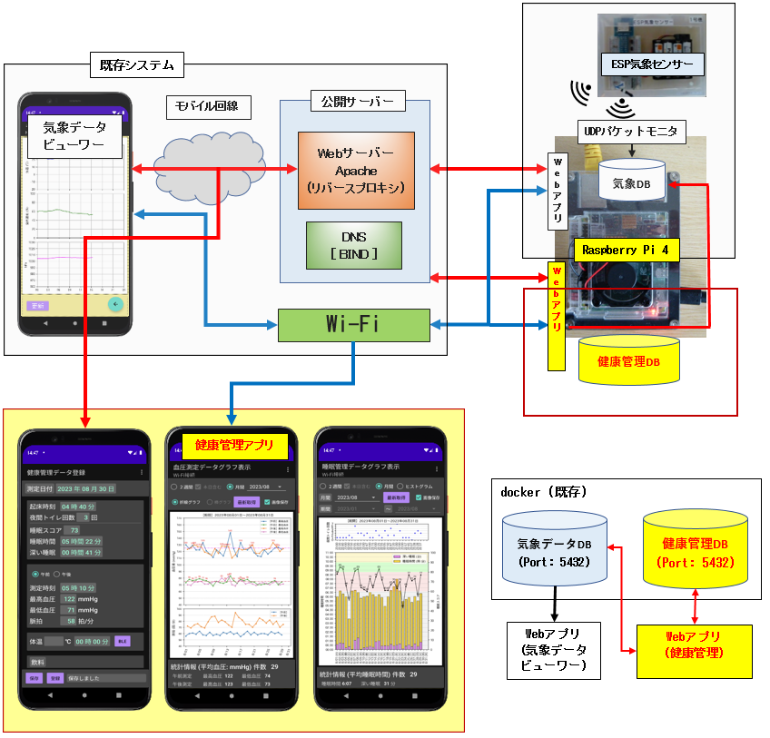

# Personal Healthcare applications

個人の健康管理データベース登録アプリケーション
+ 血圧測定データの登録と可視化
+ スマートバンドからの睡眠スコア、活動量などのデータの登録と可視化
+ 夜間頻尿要因データの登録と解析

## 1. システム概要

現在ラズパイ4で実運用している気象センサーモニターシステムにFlask健康管理登録アプリを追加する

健康管理DBはPostgreSQL12でdocker-composeで追加で動作させる。

<div>

</div>
<br/>

既存システムについてのWebアプリケーシについては下記リポジトリをご覧ください  
https://github.com/pipito-yukio/raspi4_apps

気象データビューワーと公開サーバーについては下記リポジトリをご覧ください  
https://github.com/pipito-yukio/weather_data_viewer


健康管理登録アプリ実装方法の詳しい解説については下記GithubPagesをご覧ください  
https://pipito-yukio.github.io/personal_healthcare/

## 2. 開発環境

Raspberry Pi 4 Model B が品薄状態のなか本番稼働している実機が1台しかないためシステムを追加する前にテスト用サーバー環境としてUbuntuワークステーションに下記のような開発環境を構築する。

<div>

</div>
<br/>

### 2.1 サーバーWebアプリケーション (Flask2)

+ [ソースコード] src/webapp/

| 開発言語 | ライブラリ | version  | 用　途 |
|----------|-----------|--|--|
| Flask アプリ | python 仮想環境 | raspi4_apps |
|  | Flask | 2.1.3 | デバック用サーバー |
|  | waitres | 2.1.2 | 本番用WSGIサーバー |
|  | SQLAlchemy | 2.0以上 | ORマッパー ※Flask-SQLAlchemyは利用しない |
|  | psycopg2-binary | 2.9. | PostgreSQL用driver | 
|  | matplotlib | 3.5.2 | データ可視化 |
|  | pandas | 1.4.3 | Database読み込み |


### 2.2 バッチアプリケーション (Python)

WebアプリケーシにSQLAlchemyを使ったデータベース処理(処理クラス含む)を組み込む前にバッチ処理で検証する

+ [ソースコード] src/batch

| 開発言語 | ライブラリ | version  | 用　途 |
|----------|-----------|--|--|
| Python | python 仮想環境 | py_healthcare_tool |
|  | SQLAlchemy | 2.0以上 | ORマッパー |
|  | psycopg2-binary | 2.9. | PostgreSQL用driver | 
|  | openpyxl | 3.1.2| Excelシートからcsvファイルを生成 |
  プロセス


### 2.3 Androidアプリケーション

+ [ソースコード] src/android-health-care-example
+ 開発環境  
  Android Studio for Ubuntu 64bit

### 2.4 データベースとテーブル定義

+ [ソースコード] src/data/sql


## 3.アプリケーションインストーラーを作成する

+ 気象データビューワーのインスール時にdockerとdocker-composeがインストールしており、ラズパイ４ではPostgreSQLがdockerコンテナーサービスとして稼働しているので、インストーラースクリプトでは docker exec コマンドを使ってデータベース作成とテーブルの作成を行います。

### 3-1.インストーラーのファイル構成

* [**src/installer**] 
```
src/installer/
├── 1_create_healthcare_db.sh    // 健康管理データベース作成等シェルスクリプト (1)
├── 3_import_healthcare.sh       // 健康管理テーブル作成とCSVインポートシェルスクリプト (2)
├── 4_inst_webapp_healthcare.sh  // 健康管理Flaskアプリサービス登録シェルスクリプト (3)
├── Healthcare // Flaskアプリケーシ
│   ├── healthcare
│   │   ├── __init__.py   // Flaskアプリケーション生成、DBセッションクラス取得
│   │   ├── config.py
│   │   ├── dao           // データベース登録用DAOクラス
│   │   │   ├── __init__.py
│   │   │   ├── blood_pressure.py
│   │   │   ├── body_temperature.py
│   │   │   ├── conf
│   │   │   ├── nocturia_factors.py
│   │   │   ├── person.py
│   │   │   ├── queries.py
│   │   │   ├── sleep_management.py
│   │   │   ├── walking_count.py
│   │   │   └── weather_condition.py
│   │   ├── log
│   │   │   ├── __init__.py
│   │   │   ├── logconf_main.json
│   │   │   └── logsetting.py
│   │   ├── messages
│   │   │   └── requestkeys.conf
│   │   ├── static
│   │   │   ├── content
│   │   │   │   ├── BadRequest_png_base64encoded.txt
│   │   │   │   └── InternalServerError_png_base64encoded.txt
│   │   │   ├── css
│   │   │   └── js
│   │   ├── templates
│   │   ├── util
│   │   │   ├── __init__.py
│   │   │   ├── dateutil.py
│   │   │   ├── file_util.py
│   │   │   └── image_util.py
│   │   └── views
│   │       ├── __init__.py
│   │       └── app_main.py  // リクエスト処理メイン
│   ├── run.py // プロダクション起動の場合は waitress, それ以外はFlaskアプリをDEBUG実行
│   └── start.sh  // run.pyを実行するシェルスクリプト(ホスト名とポート番号、起動種別の設定)
├── bin
│   └── conf // データベース接続情報 (SQLAlchemy用) 
│       ├── db_healthcare.json    // 新規作成する健康管理データベース 
│       └── db_sensors.json       // 既存の気象センサーデータベース
├── data
│   └── sql
│       ├── health                 // 健康管理
│       │   ├── 10_createdb.sql               // データベース作成SQL 
│       │   ├── 11_createtable.sql            // テーブル作成SQL
│       │   ├── 20_insert_person.sql          // ユーザ登録SQL
│       │   ├── README.txt作成等
│       │   ├── create_healthcare_db.sh       // データベース作成シェルスクリプト
│       │   ├── create_healthcare_tables.sh   // テーブル作成シェルスクリプト
│       │   ├── csv                // 2023-01〜2023-03 分の登録用データ
│       │   │   ├── blood_pressure.csv
│       │   │   ├── body_temperature.csv
│       │   │   ├── nocturia_factors.csv
│       │   │   ├── sleep_management.csv
│       │   │   └── walking_count.csv
│       │   └── import_from_csv.sh  // CSV一括インポートシェルスクリプト 
│       └── weather                  // 気象センサーデータベース
│           ├── 21_createtable_weather_condition.sql // 天候状態テーブル作成SQL
│           ├── README.txt
│           ├── add_weather_table.sh  // 天候状態テーブル作成シェルスクリプト
│           ├── csv                   // 2023-01〜2023-03 分の登録用データ
│           │   └── weather_condition.csv
│           └── import_sensor_csv.sh  // CSVインポートシェルスクリプト 
└── work
    └── etc
        ├── default作成等
        │   └── webapp-healthcare     // 健康管理Flaskアプリケーションポート番号
        └── systemd
            └── system
                └── webapp-healthcare.service // サービス定義ファイル
```

### 3-2. (1) 健康管理データベース作成等シェルスクリプト
+ 1_create_healthcare_db.sh

```bash
#!/bin/bash

# 既存のsensors_pgdbに天候テーブルを追加しCSVをインポートする
docker exec -it postgres-12 sh -c "$HOME/data/sql/weather/add_weather_table.sh"  # 1-1
exit1=$?
echo "add_weather_table.sh >> status=$exit1"
if [ $exit1 -ne 0 ]; then
   exit $exit1
fi

# 既存のdockerコンテナからhealthcare_db作成
docker exec -it postgres-12 sh -c "$HOME/data/sql/health/create_healthcare_db.sh" # 1-2 
exit1=$?
echo "create_healthcare_db.sh >> status=$exit1"
if [ $exit1 -ne 0 ]; then
   exit $exit1
fi

# マイグレーション用の古いスクリプトとCSVディレクトリ削除
cd ~/data/sql健康管理Flaskアプリサービス登録シェルスクリプト 

echo "Done."
```

+ 1-1. data/sql/weather/add_weather_table.sh
```bash
#!/bin/bash

# postgres-12 container on sensors_pgdb
cd /home/pi/data/sql/weather
# 天候状態テーブル追加
psql -Udeveloper -d sensors_pgdb < 21_createtable_weather_condition.sql
exit1=$?
echo "21_createtable_weather_condition.sql >> status=$exit1"
if [ $exit1 -ne 0 ]; then
   exit $exit1
fi

sleep 1

# 天候データCSVのインポート
psql -Udeveloper -d sensors_pgdb -c "\copy weather.weather_condition FROM '/home/pi/data/sql/weather/csv/weather_condition.csv' DELIMITER ',' CSV HEADER;"
```

+ data/sql/weather/21_createtable_weather_condition.sql
```SQL
CREATE TABLE IF NOT EXISTS weather.weather_condition(
   measurement_day date NOT NULL,
   condition VARCHAR(60) NOT NULL,
   CONSTRAINT pk_weather_condition PRIMARY KEY (measurement_day)
);
ALTER TABLE weather.weather_condition OWNER TO developer;
```

+ 1-2. data/sql/health/create_healthcare_db.sh
```bash
#!/bin/bash

# postgres-12 container
cd /home/pi/data/sql/health
psql -Upostgres < 10_createdb.sql
```

### 3-2. (2) 健康管理テーブル作成とCSVインポートシェルスクリプト
+ 3_import_healthcare.sh
```bash
#!/bin/bash

# 健康管理テーブル作成
docker exec -it postgres-12 sh -c "$HOME/data/sql/health/create_healthcare_tables.sh" # 2-1
exit1=$?
echo "Create_healthcare_tables.sh >> status=$exit1"
if [ $exit1 -ne 0 ]; then
   exit $exit1
fi

sleep 2

# CSVをインポートする
docker exec -it postgres-12 sh -c "$HOME/data/sql/health/import_from_csv.sh"  # 2-2
exit1=$?
echo "Import_from_csv.sh >> status=$exit1"

cd ~

echo "Done."
```

+ 2-1 data/sql/health/create_healthcare_tables.sh
```bash
#!/bin/bash

# postgres-12
cd /home/pi/data/sql/health
psql -Udeveloper healthcare_db < 11_createtable.sql
sleep 1
# Deafult person into bodyhealth.person  
psql -Udeveloper healthcare_db < 20_insert_person.sql
```

+ data/sql/health/11_createtable.sql
```SQL
\connnect healthcare_db

DROP INDEX IF EXISTS bodyhealth.idx_person_email;
DROP TABLE IF EXISTS bodyhealth.sleep_management;
DROP TABLE IF EXISTS bodyhealth.blood_pressure;
DROP TABLE IF EXISTS bodyhealth.body_temperature;
DROP TABLE IF EXISTS bodyhealth.walking_count;
DROP TABLE IF EXISTS bodyhealth.nocturia_factors;
DROP TABLE IF EXISTS bodyhealth.person;
DROP SCHEMA IF EXISTS bodyhealth;

-- 体健康
CREATE SCHEMA IF NOT EXISTS bodyhealth;

-- ユーザーテーブル
CREATE TABLE IF NOT EXISTS bodyhealth.person(
   id smallint NOT NULL,
   email varchar(50) NOT NULL,
   name varchar(24) NOT NULL,
   CONSTRAINT pk_person PRIMARY KEY (id)
);
CREATE UNIQUE INDEX idx_person_email ON bodyhealth.person (email);

-- 睡眠管理テーブル
CREATE TABLE IF NOT EXISTS bodyhealth.sleep_management(
  pid smallint NOT NULL,
  measurement_day date NOT NULL,
  wakeup_time time without time zone NOT NULL,
  sleep_score smallint,
  sleeping_time time without time zone NOT NULL,
  deep_sleeping_time time without time zone
);

-- 血圧管理テーブル
CREATE TABLE IF NOT EXISTS bodyhealth.blood_pressure(
  pid smallint NOT NULL,
  measurement_day date NOT NULL,
  morning_measurement_time time without time zone,
  morning_max smallint,
  morning_min smallint,
  morning_pulse_rate smallint,
  evening_measurement_time time without time zone,
  evening_max smallint,
  evening_min smallint,
  evening_pulse_rate smallint
);

-- 体温測定テーブル: 任意
CREATE TABLE IF NOT EXISTS bodyhealth.body_temperature(
  pid smallint NOT NULL,
  measurement_day date NOT NULL,
  measurement_time time without time zone,
  temperature real
);

-- 歩数テーブル
CREATE TABLE IF NOT EXISTS bodyhealth.walking_count(
  pid smallint NOT NULL,
  measurement_day date NOT NULL,
  counts smallint NOT NULL
);

-- 夜中トイレ回数要因テーブル
CREATE TABLE IF NOT EXISTS bodyhealth.nocturia_factors(
  pid smallint NOT NULL,
  measurement_day date NOT NULL,
  midnight_toilet_visits smallint NOT NULL,
  has_coffee boolean,
  has_tea boolean,
  has_alcohol boolean,
  has_nutrition_drink boolean,
  has_sports_drink boolean,
  has_diuretic boolean,
  take_medicine boolean,
  take_bathing boolean,
  condition_memo varchar(255)
);

ALTER TABLE bodyhealth.sleep_management ADD CONSTRAINT pkey_sleep_management
   PRIMARY KEY (pid, measurement_day);
ALTER TABLE bodyhealth.sleep_management ADD CONSTRAINT fkey_sleep_management_person
   FOREIGN KEY (pid) REFERENCES bodyhealth.person(id) ON DELETE CASCADE;

ALTER TABLE bodyhealth.blood_pressure ADD CONSTRAINT pkey_blood_pressure
   PRIMARY KEY (pid, measurement_day);
ALTER TABLE bodyhealth.blood_pressure ADD CONSTRAINT fkey_blood_pressure_person
   FOREIGN KEY (pid) REFERENCES bodyhealth.person(id) ON DELETE CASCADE;

ALTER TABLE bodyhealth.body_temperature ADD CONSTRAINT pkey_body_temperature
   PRIMARY KEY (pid, measurement_day);
ALTER TABLE bodyhealth.body_temperature ADD CONSTRAINT fkey_body_temperature_person
   FOREIGN KEY (pid) REFERENCES bodyhealth.person(id) ON DELETE CASCADE;

ALTER TABLE bodyhealth.walking_count ADD CONSTRAINT pkey_walking_count
   PRIMARY KEY (pid, measurement_day);
ALTER TABLE bodyhealth.walking_count ADD CONSTRAINT fkey_walking_count_person
   FOREIGN KEY (pid) REFERENCES bodyhealth.person(id) ON DELETE CASCADE;

ALTER TABLE bodyhealth.nocturia_factors ADD CONSTRAINT pkey_nocturia_factors
   PRIMARY KEY (pid, measurement_day);
ALTER TABLE bodyhealth.nocturia_factors ADD CONSTRAINT fkey_nocturia_factors_person
   FOREIGN KEY (pid) REFERENCES bodyhealth.person(id) ON DELETE CASCADE;

ALTER SCHEMA bodyhealth OWNER TO developer;
ALTER TABLE bodyhealth.person OWNER TO developer;
ALTER TABLE bodyhealth.sleep_management OWNER TO developer;
ALTER TABLE bodyhealth.blood_pressure OWNER TO developer;
ALTER TABLE bodyhealth.body_temperature OWNER TO developer;
ALTER TABLE bodyhealth.walking_count OWNER TO developer;
ALTER TABLE bodyhealth.nocturia_factors OWNER TO developer;
```

+ data/sql/health/20_insert_person.sql
```SQL
\connect healthcare_db

INSERT INTO bodyhealth.person(id, email, name) VALUES (1, 'user1@examples.com','テスト　太郎');
```

+ 2-2 data/sql/health/data/sql/health/import_from_csv.sh
```bash
#!/bin/bash

# https://stackoverflow.com/questions/34736762/script-to-automat-import-of-csv-into-postgresql
#   Script to automat import of CSV into PostgreSQL

# FK制約をドロップ
psql -Udeveloper -d healthcare_db -c "ALTER TABLE bodyhealth.sleep_management DROP CONSTRAINT fkey_sleep_management_person;"
psql -Udeveloper -d healthcare_db -c "ALTER TABLE bodyhealth.blood_pressure DROP CONSTRAINT fkey_blood_pressure_person;"
psql -Udeveloper -d healthcare_db -c "ALTER TABLE bodyhealth.nocturia_factors DROP CONSTRAINT fkey_nocturia_factors_person;"
psql -Udeveloper -d healthcare_db -c "ALTER TABLE bodyhealth.walking_count DROP CONSTRAINT fkey_walking_count_person;"
psql -Udeveloper -d healthcare_db -c "ALTER TABLE bodyhealth.body_temperature DROP CONSTRAINT fkey_body_temperature_person;"
# PK制約をドロップ
psql -Udeveloper -d healthcare_db -c "ALTER TABLE bodyhealth.sleep_management DROP CONSTRAINT pkey_sleep_management;"
psql -Udeveloper -d healthcare_db -c "ALTER TABLE bodyhealth.blood_pressure DROP CONSTRAINT pkey_blood_pressure;"
psql -Udeveloper -d healthcare_db -c "ALTER TABLE bodyhealth.nocturia_factors DROP CONSTRAINT pkey_nocturia_factors;"
psql -Udeveloper -d healthcare_db -c "ALTER TABLE bodyhealth.walking_count DROP CONSTRAINT pkey_walking_count;"
psql -Udeveloper -d healthcare_db -c "ALTER TABLE bodyhealth.body_temperature DROP CONSTRAINT pkey_body_temperature;"


sleep 2

# データインポート
# 睡眠管理
psql -Udeveloper -d healthcare_db -c "\copy bodyhealth.sleep_management FROM '/home/pi/data/sql/health/csv/sleep_management.csv' DELIMITER ',' CSV HEADER;"
# 血圧データ
psql -Udeveloper -d healthcare_db -c "\copy bodyhealth.blood_pressure FROM '/home/pi/data/sql/health/csv/blood_pressure.csv' DELIMITER ',' CSV HEADER;"
# 夜間頻尿要因
psql -Udeveloper -d healthcare_db -c "\copy bodyhealth.nocturia_factors FROM '/home/pi/data/sql/health/csv/nocturia_factors.csv' DELIMITER ',' CSV HEADER;"
# 歩数データ$ tar czvf ../raspi4_healthcare.tar.gz 1_create_healthcare_db.sh 3_import_healthcare.sh \4_inst_webapp_healthcare.sh data work bin docker Healthcare/
psql -Udeveloper -d healthcare_db -c "\copy bodyhealth.walking_count FROM '/home/pi/data/sql/health/csv/walking_count.csv' DELIMITER ',' CSV HEADER;"
# 体温測定データ
psql -Udeveloper -d healthcare_db -c "\copy bodyhealth.body_temperature FROM '/home/pi/data/sql/health/csv/body_temperature.csv' DELIMITER ',' CSV HEADER;"

# PK制約を戻す
psql -Udeveloper -d healthcare_db -c "ALTER TABLE bodyhealth.sleep_management ADD CONSTRAINT pkey_sleep_management PRIMARY KEY (pid, measurement_day);"
psql -Udeveloper -d healthcare_db -c "ALTER TABLE bodyhealth.blood_pressure ADD CONSTRAINT pkey_blood_pressure PRIMARY KEY (pid, measurement_day);"
psql -Udeveloper -d healthcare_db -c "ALTER TABLE bodyhealth.nocturia_factors ADD CONSTRAINT pkey_nocturia_factors PRIMARY KEY (pid, measurement_day);"
psql -Udeveloper -d healthcare_db -c "ALTER TABLE bodyhealth.walking_count ADD CONSTRAINT pkey_walking_count PRIMARY KEY (pid, measurement_day);"
psql -Udeveloper -d healthcare_db -c "ALTER TABLE bodyhealth.body_temperature ADD CONSTRAINT pkey_body_temperature PRIMARY KEY (pid, measurement_day);"
# FK制約を戻す
psql -Udeveloper -d healthcare_db -c "ALTER TABLE bodyhealth.sleep_management ADD CONSTRAINT fkey_sleep_management_person FOREIGN KEY (pid) REFERENCES bodyhealth.person (id) ON DELETE CASCADE;"
psql -Udeveloper -d healthcare_db -c "ALTER TABLE bodyhealth.blood_pressure ADD CONSTRAINT fkey_blood_pressure_person FOREIGN KEY (pid) REFERENCES bodyhealth.person (id) ON DELETE CASCADE;"
psql -Udeveloper -d healthcare_db -c "ALTER TABLE bodyhealth.nocturia_factors ADD CONSTRAINT fkey_nocturia_factors_person FOREIGN KEY (pid) REFERENCES bodyhealth.person (id) ON DELETE CASCADE;"
psql -Udeveloper -d healthcare_db -c "ALTER TABLE bodyhealth.walking_count ADD CONSTRAINT fkey_walking_count_person FOREIGN KEY (pid) REFERENCES bodyhealth.person (id) ON DELETE CASCADE;"
psql -Udeveloper -d healthcare_db -c "ALTER TABLE bodyhealth.body_temperature ADD CONSTRAINT fkey_body_temperature_person FOREIGN KEY (pid) REFERENCES bodyhealth.person (id) ON DELETE CASCADE;"
```

### 3-2. (3) 健康管理Flaskアプリサービス登録シェルスクリプト 
+ 4_inst_webapp_healthcare.sh
```bash
#!/bin/bash

# execute before export my_passwd=xxxxxx

# Add SQLAlchemy
cd ~/py_venv
. raspi4_apps/bin/activate
pip install sqlalchemy>=2.0.0
cd ~/

# Enable webapp service
echo $my_passwd | { sudo --stdin cp ~/work/etc/default/webapp-healthcare /etc/default
  sudo cp ~/work/etc/systemd/system/webapp-healthcare.service /etc/systemd/system
  sudo systemctl enable webapp-healthcare.service
}

echo "rebooting."
echo $my_passwd |sudo --stdin reboot
```

+ work/etc/default/webapp-healthcare
```
FLASK_PROD_PORT=12920
```

+ work/etc/systemd/system/webapp-healthcare.service
```
[Unit]
Description=Flask webapp Healthcare service
After=postgres-12-docker.service

[Service]
Type=idle
# FLASK_PROD_PORT
EnvironmentFile=/etc/default/webapp-healthcare
ExecStart=/home/pi/Healthcare/start.sh prod >/dev/null
User=pi

[Install]
WantedBy=multi-user.target
```

### 3-3.ラズパイ4のSDカードをバックアップ
+ インストールに失敗した場合に備え、元に戻すためSDカード(64GB)のバックアップを取っておきます  
※バックアップ時間は約65分ぐらい掛かりました。サイズは約2GBです。
```
sudo dd bs=4M if=/dev/sdc | gzip > PiOS-64bit-raspi-4-2023-04-11.img.gz
15226+1 レコード入力
15226+1 レコード出力
63864569856 bytes (64 GB, 59 GiB) copied, 3816.94 s, 16.7 MB/s
```

### 3-4.開発PCでtarアーカイブを作成しラズパイ４にコピーする
```bash
$ tar czvf ../raspi4_healthcare.tar.gz 1_create_healthcare_db.sh 3_import_healthcare.sh 4_inst_webapp_healthcare.sh data work bin docker Healthcare/  

$ scp ../raspi4_healthcare.tar.gz pi@raspi-4:/home/pi
```

### 3-5.ラズパイ４側で前準備

(1) UDPバケットモニターサービスを停止する  
※10分間隔でESP気象センサーからのUDPパケットを受信し気象テーブルに登録している
```bash
pi@raspi-4:~ $ sudo systemctl stop udp-weather-mon.service 
pi@raspi-4:~ $ sudo systemctl disable udp-weather-mon.service 
Removed /etc/systemd/system/multi-user.target.wants/udp-weather-mon.service.
```

(2) tarアーカイブを解凍する ※下記は解凍した後のディレクトリ構成
```
pi@raspi-4:~ $ tar xzf raspi4_healthcare.tar.gz
pi@raspi-4:~ $ ls -lrt
合計 132
drwxr-xr-x 2 pi pi  4096  4月  4  2022 Bookshelf
drwxr-xr-x 2 pi pi  4096  4月  4  2022 Desktop
drwxr-xr-x 2 pi pi  4096  4月  4  2022 Videos
drwxr-xr-x 2 pi pi  4096  4月  4  2022 Templates
drwxr-xr-x 2 pi pi  4096  4月  4  2022 Public
drwxr-xr-x 2 pi pi  4096  4月  4  2022 Pictures
drwxr-xr-x 2 pi pi  4096  4月  4  2022 Music
drwxr-xr-x 2 pi pi  4096  4月  4  2022 Documents
drwxr-xr-x 3 pi pi  4096  8月  3  2022 logs
drwxr-xr-x 3 pi pi  4096  8月  3  2022 db
drwxr-xr-x 3 pi pi  4096  9月  3  2022 py_venv
drwxr-xr-x 3 pi pi  4096  9月  3  2022 webapp
drwxr-xr-x 3 pi pi  4096  9月 21  2022 Downloads
drwxr-xr-x 3 pi pi  4096  9月 23  2022 PlotWeatherForRaspi4
drwxr-xr-x 3 pi pi  4096  4月 10 11:57 data
drwxr-xr-x 3 pi pi  4096  4月 10 13:42 work
drwxr-xr-x 4 pi pi  4096  4月 10 13:42 docker
drwxr-xr-x 4 pi pi  4096  4月 10 13:42 bin
drwxr-xr-x 3 pi pi  4096  4月 10 13:47 Healthcare
-rwxr-xr-x 1 pi pi   450  4月 10 15:46 4_inst_webapp_healthcare.sh
-rwxr-xr-x 1 pi pi   577  4月 11 09:52 1_create_healthcare_db.sh
-rwxr-xr-x 1 pi pi   720  4月 11 10:23 2_inst_healthcare_container.sh
-rwxr-xr-x 1 pi pi   643  4月 11 10:37 3_import_healthcare.sh
-rw-r--r-- 1 pi pi 40179  4月 11 13:20 raspi4_healthcare.tar.gz
```

### 3-6.インストール実行

(1) 健康管理データベース作成等シェルスクリプトを実行する  
+ 健康管理データベースを作成する
+ 既存の気象センサーデータベースに天候テーブルを追加しCSVファイルから過去３ヶ月分の天候データをインポートする
```bash
pi@raspi-4:~ $ ./1_create_healthcare_db.sh 
CREATE TABLE
ALTER TABLE
21_createtable_weather_condition.sql >> status=0
COPY 99
add_weather_table.sh >> status=0
CREATE DATABASE
GRANT
create_healthcare_db.sh >> status=0
Done.
```

(2) 健康管理テーブル作成とCSVインポートシェルスクリプトを実行する  
+ 健康管理データベースに健康管理テーブルを作成する
+ 健康管理テーブルにCSVファイルから過去３ヶ月分の健康管理データをインポートする

```bash
pi@raspi-4:~ $ ./3_import_healthcare.sh 
invalid command \connnect
NOTICE:  schema "bodyhealth" does not exist, skipping
DROP INDEX
NOTICE:  schema "bodyhealth" does not exist, skipping
DROP TABLE
NOTICE:  schema "bodyhealth" does not exist, skipping
DROP TABLE
NOTICE:  schema "bodyhealth" does not exist, skipping
DROP TABLE
NOTICE:  schema "bodyhealth" does not exist, skipping
DROP TABLE
NOTICE:  schema "bodyhealth" does not exist, skipping
DROP TABLE
NOTICE:  schema "bodyhealth" does not exist, skipping
DROP TABLE
NOTICE:  schema "bodyhealth" does not exist, skipping
DROP SCHEMA
CREATE SCHEMA
CREATE TABLE
CREATE INDEX
CREATE TABLE
CREATE TABLE
CREATE TABLE
CREATE TABLE
ALTER TABLE
ALTER TABLE
ALTER TABLE
ALTER TABLE
ALTER TABLE
ALTER TABLE
ALTER TABLE
ALTER TABLE
ALTER TABLE
ALTER TABLE
ALTER SCHEMA
ALTER TABLE
ALTER TABLE
ALTER TABLE
ALTER TABLE
ALTER TABLE
ALTER TABLE
You are now connected to database "healthcare_db" as user "developer".
INSERT 0 1
Create_healthcare_tables.sh >> status=0
ALTER TABLE
ALTER TABLE
ALTER TABLE
ALTER TABLE
ALTER TABLE
ALTER TABLE
ALTER TABLE
ALTER TABLE
ALTER TABLE
ALTER TABLE
COPY 99
COPY 99
COPY 99の
COPY 99
COPY 99
ALTER TABLE
ALTER TABLE
ALTER TABLE
ALTER TABLE
ALTER TABLE
ALTER TABLE
ALTER TABLE
ALTER TABLE
ALTER TABLE
ALTER TABLE
Import_from_csv.sh >> status=0
Done.
```

(3) 健康管理Flaskアプリサービス登録シェルスクリプトを実行する  
+ 実行前にpiユーザのパスワードを設定する
+ インストールが完了するとリブートする
 
```bash
pi@raspi-4:~ $ export my_passwd=xxxxxxx
pi@raspi-4:~ $ ./4_inst_webapp_healthcare.sh 

[notice] A new release of pip available: 22.2.2 -> 23.0.1
[notice] To update, run: pip install --upgrade pip
Created symlink /etc/systemd/system/multi-user.target.wants/webapp-healthcare.service → /etc/systemd/system/webapp-healthcare.service.
rebooting.
Connection to raspi-4 closed by remote host.
Connection to raspi-4 closed.
```

### 3-6.インストール後の確認作業

(1) 健康管理テーブル件数確認
```
pi@raspi-4:~ $ docker exec -it postgres-12 bin/bash

bash-5.1# echo "SELECT COUNT(*) FROM bodyhealth.blood_pressure;" | psql -Udeveloper healthcare_db
 count 
-------
    99
(1 row)

bash-5.1# echo "SELECT COUNT(*) FROM bodyhealth.sleep_management;" | psql -Udeveloper healthcare_db
 count 
-------
    99
(1 row)

bash-5.1# echo "SELECT COUNT(*) FROM bodyhealth.walking_count;" | psql -Udeveloper healthcare_db
 count 
-------
    99
(1 row)

bash-5.1# echo "SELECT COUNT(*) FROM bodyhealth.nocturia_factors;" | psql -Udeveloper healthcare_db
 count 
-------
    99
(1 row)

bash-5.1# echo "SELECT COUNT(*) FROM bodyhealth.body_temperature;" | psql -Udeveloper healthcare_db
 count 
-------
    99
(1 row)

```

(2) リブート後のサービス確認
```bash
pi@raspi-4:~ $ sudo systemctl status webapp-healthcare.service 
● webapp-healthcare.service - Flask webapp Healthcare service
     Loaded: loaded (/etc/systemd/system/webapp-healthcare.service; enabled; vendor preset: enabled)
     Active: active (running) since Tue 2023-04-11 14:30:22 JST; 2min 12s ago
   Main PID: 1223 (start.sh)
      Tasks: 6 (limit: 8897)
        CPU: 1.558s
     CGroup: /system.slice/webapp-healthcare.service
             ├─1223 /bin/bash /home/pi/Healthcare/start.sh prod >/dev/null
             └─1227 python /home/pi/Healthcare/run.py

 4月 11 14:30:22 raspi-4 systemd[1]: Started Flask webapp Healthcare service.
 4月 11 14:30:22 raspi-4 start.sh[1223]: raspi-4.local with production
```

### 4.健康管理Flaskアプリインストール後の動作確認

<div>

</div>
<br/>
